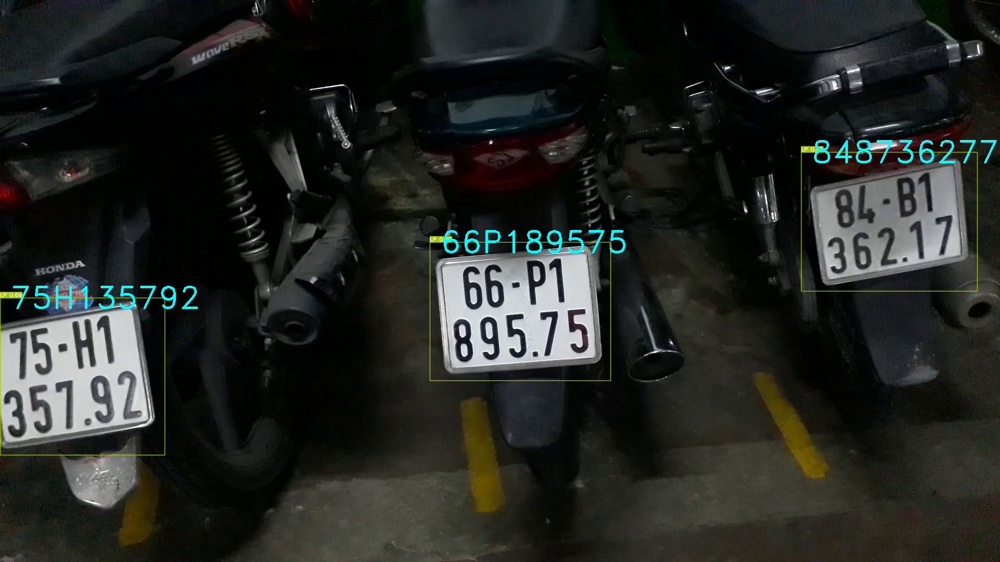
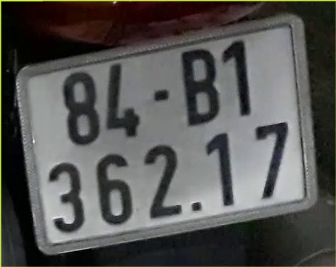
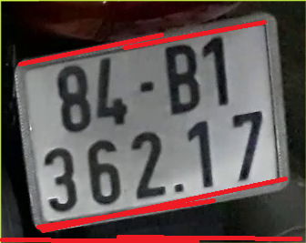
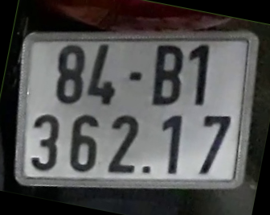

# License-Plate-Recognition-YOLOv7-and-CNN
Check out my 2 YOUTUBE channels for more:
1. [Mrzaizai2k - AI](https://www.youtube.com/channel/UCFGCVG0P2eLS5jkDaE0vSfA) (NEW)
2. [Mrzaizai2k](https://www.youtube.com/channel/UCCq3lQ1W437euT9eq2_26HQ) (old)

This project is for the ultimate manner of identifying the License Plate. Combining YOLOv7 object detection, Hough transform alignment, and CNN character recognition
	
I created a [Vietnamese License Plate Recognition tool using image processing OpenCV and KNN algorithm](https://github.com/mrzaizai2k/VIETNAMESE_LICENSE_PLATE) (simple, but effective)

<i>Figure. Input license plate </i>

<i>Figure. Final result </i>

## Table of contents
* [1. How to use](#1-How-to-use)
* [2. Introduction](#2-Introduction)
* [3. License Plate Detection](#3-License-Plate-Detection)
* [4. Hough Transform Alignment](#4-Hough-Transform-Alignment)
* [5. Character Segmentation and Recognition](#5-Character-Segmentation-and-Recognition)
* [6. Conclusion](#6-Conclusion)

## 1. How to use

* Remember to set up neccesary libraries in `requirements.txt` 
* Download the model used for YOLOv7 model `LP_detect_yolov7_500img.pt` and CNN model `weight.h5` in Git RELEASES and put them in the right path like in the code
* To test on image/video, run `main_image.py`/ `main_video.py`. Remember to change the path of image/video. I don't provide videos for testing, but you can record it yourself. **1920x1080 pixels, 24 fps recommend**
* In `data` folder you can find `data.yaml` needed for YOLOv7 training and folder `test` including test images. Feel free to use it
* `doc` images for documents
* `src` folder are codes for CNN model. put the CNN model here
* `utils` and `models` are for YOLOv7. They're a part of original YOLO. However, don't care about them, you can use YOLOv7 to derectly detect License Plates with `detect.py`. I have changed the code a lot compared to the original one. It's now much easier to use
* `Preprocess.py`, `utils_LP.py` and `vid2img.py` are util files. Spend time to explore them.
* `yolo-v7-license-plate-detection.ipynb` is the training of YOLOv7

## 2. Introduction
As you know: **There are 3 main stages in the license plate recoginition algorithm**

1. License Plate Detection
2. Character Segmentation
3. Character Recognition

<i>Figure. The main stages in the license plate recoginition algorithm </i>

## 3. License Plate Detection
Difference form my previous repo. I detected LP with just image preprocessing. It was quite complicated and low accuracy. But now with YOLOv7, all we have to do is collecting the data and train the model

1. Instead of taking a lot of pictures for training, I recoreded the video and use `vid2img.py` to split frames into images
2. I used [labelImg](https://github.com/heartexlabs/labelImg#create-pre-defined-classes) to label each images. We will have the `.txt` file in the same folder with the image. `.txt` file include label, x, y, w, h
3. Split the dataset into 70/20/10
4. Train YOLOv7 on Kaggle 

You can find the whole dataset and the code on my kaggle: [YOLO V7 License Plate Detection](https://www.kaggle.com/code/bomaich/yolo-v7-license-plate-detection)

**[Dataset](https://www.kaggle.com/datasets/bomaich/vnlicenseplate) include 1000 images of both 1 and 2 lines Vietnamese License Plates**

The result is quite good

<i>Figure. Detected License Plate </i>

## 4. Hough Transform Alignment

With previous repo, I tried to find the biggest contour, and from 4 coordinates of that contour, I can rotate the License Plate; however, it has 2 problems with contour
* Not sure that the biggest contour is the LP. Somtimes the view is not good which is hard to find the right contour
* Not sure that we can approx that contour to 4 points. If not, we can't calculate the rotate angle

Now I come up with different approach. 
1. I used Hough transform to find the horizontal lines 
2. Using some criterias (length, angle...) to find the right ones
3. Calculate angles and `angles.mean()`
4. Rotate the LP with `angles.mean()`

            

<i>Figure. Rotated License Plate </i>

## 5. Character Segmentation and Recognition

Here I used the same technique as before. I won't talk much about this part, because so many people have done that
1. Find contours
2. Filter out the right contour
3. Recognize with CNN

            

<i>Figure. Find and extract characters </i>

<i>Figure. Character segmentation result </i>

## 6. Conclusion

            

<i>Figure. Final results </i>

